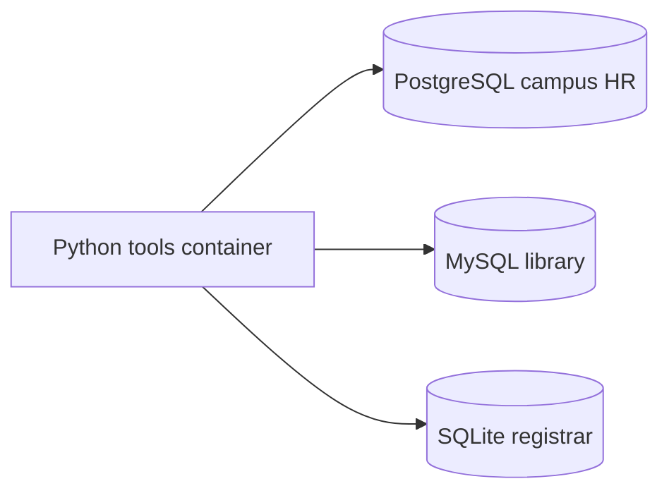

# Rel2KG

[](LICENSE)
[](pyproject.toml)
[](docker-compose.yml)

Relational tables first. Semantic web next.

Three independently run campus systems store overlapping facts about the same people. This repository instantiates those systems with **Docker only** — nothing is installed on the host — so later work (R2RML / RDFS / SPARQL) has real heterogeneous sources to map.

Apache-2.0. Status: lab / alpha.

## Why these three databases

They are the three most widely used open-source relational engines, and they disagree just enough to be useful for integration:

| Engine | Role in this lab | Image |
| --- | --- | --- |
| **PostgreSQL 16** | Campus HR (`campus`) | `postgres:16-alpine` |
| **MySQL 8.4** | Campus library (`library`) | `mysql:8.4` |
| **SQLite 3** | Campus registrar (`courses.db`) | file on a Docker volume, created by the Python image |

Same people, three schemas, three dialects. The join key today is email. Later it becomes an IRI.

## Schemas

PostgreSQL — people:

- `department(id, code, name)`
- `employee(id, given_name, family_name, email, department_id, hired_on)`

MySQL — books and loans:

- `author(id, full_name, email)`
- `book(id, isbn, title, published_year, author_id)`
- `loan(id, borrower_email, book_id, loaned_on, returned_on)`

SQLite — courses:

- `course(id, code, title, credits)`
- `enrollment(id, student_email, course_id, term, grade)`



## Requirements

- Docker Engine with Compose v2 (Docker Desktop is fine)
- That is all. Python, drivers, and the databases run in images.

## Quick start

```bash
git clone <this-repo> rel2kg
cd rel2kg
make bootstrap
```

Equivalent Compose commands:

```bash
docker compose up --build -d --wait postgres mysql
docker compose run --rm --build tools
```

That starts PostgreSQL and MySQL (seed SQL runs on the first empty volume), creates the SQLite file, and prints a status report. Re-run the report with `make verify`.

### Host ports and credentials

| Source | Host | Inside Compose |
| --- | --- | --- |
| PostgreSQL | `localhost:5432` | `postgres:5432` |
| MySQL | `localhost:3306` | `mysql:3306` |
| SQLite | volume `sqlite_data` → `/data/courses.db` | same path in `tools` |

Lab credentials (see [SECURITY.md](SECURITY.md)): user `rel2kg`, password `rel2kg`. Copy `.env.example` to `.env` to change ports or passwords (`POSTGRES_HOST_PORT`, `MYSQL_HOST_PORT`).

Inspect without installing clients:

```bash
docker compose exec postgres psql -U rel2kg -d campus
docker compose exec mysql mysql -u rel2kg -prel2kg library
docker compose run --rm --build --no-deps tools rel2kg verify
```

Stop and keep data: `make down`. Wipe and re-seed: `make reset`.

## Layout

```
docker-compose.yml     PostgreSQL + MySQL + Python tools
docker/python.Dockerfile
db/postgres/init.sql   HR schema + seed
db/mysql/init.sql      library schema + seed
db/sqlite/init.sql     registrar schema + seed
src/rel2kg/            CLI, connections, verify report
tests/                 unit tests (run in Docker)
```

## Makefile

| Target | What it does |
| --- | --- |
| `make help` | List targets |
| `make bootstrap` | Start DBs, seed SQLite, print the report |
| `make verify` | Re-run the report |
| `make test` | Unit tests in the tools image |
| `make lint` | Compose validation + Ruff |
| `make down` / `make reset` | Stop, or stop and delete volumes |

## Troubleshooting

**Cannot connect to the Docker daemon** — start Docker Desktop (or your engine) and retry.

**Port already allocated** — set `POSTGRES_HOST_PORT` / `MYSQL_HOST_PORT` in `.env`.

**Empty or stale tables after editing SQL** — PostgreSQL and MySQL init scripts run only on an empty volume. `make reset` then `make bootstrap`.

**SQLite report says the file is missing** — run `make bootstrap` once so the tools container can create `/data/courses.db`.

## Contributing

See [CONTRIBUTING.md](CONTRIBUTING.md) and [CODE_OF_CONDUCT.md](CODE_OF_CONDUCT.md). Please report vulnerabilities via [SECURITY.md](SECURITY.md), not a public issue.

## What is deliberately not here yet

- R2RML / Direct Mapping
- OWL / RDFS vocabulary
- SPARQL or a triple store
- A web UI

The tables exist and overlap. Mapping them is the next step.
