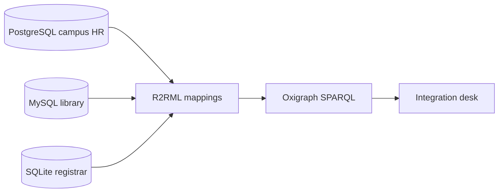

# Rel2KG

[](LICENSE)
[](pyproject.toml)
[](docker-compose.yml)

Relational tables, mapped to RDF with R2RML, queried with SPARQL.

Three independently run campus systems store overlapping facts about the same people. This repository instantiates those systems with **Docker only** — nothing is installed on the host — maps them to a shared vocabulary, serves SPARQL over Oxigraph, and shows the join on an integration desk.

Apache-2.0. Status: lab / alpha.

## Why these three databases

They are the three most widely used open-source relational engines, and they disagree just enough to be useful for integration:

| Engine | Role in this lab | Image |
| --- | --- | --- |
| **PostgreSQL 16** | Campus HR (`campus`) | `postgres:16-alpine` |
| **MySQL 8.4** | Campus library (`library`) | `mysql:8.4` |
| **SQLite 3** | Campus registrar (`courses.db`) | file on a Docker volume, created by the Python image |

Same people, three schemas, three dialects. Person IRIs are minted from email. Ada Lovelace uses the same email in every system (easy identity). Donald Knuth does not: HR has `donald@campus.example`, the library has `knuth@taocp.example`. Those IRIs are linked with `owl:sameAs` in `links/sameas.ttl`. Tim Berners-Lee and Codd have no campus counterpart.

## Schemas

PostgreSQL — people:

- `department(id, code, name)`
- `employee(id, given_name, family_name, email, department_id, hired_on)`

MySQL — books and loans:

- `author(id, full_name, email)`
- `book(id, isbn, title, published_year, author_id)`
- `loan(id, borrower_email, book_id, loaned_on, returned_on)`

SQLite — courses:

- `course(id, code, title, credits)`
- `enrollment(id, student_email, course_id, term, grade)`



## Requirements

- Docker Engine with Compose v2 (Docker Desktop is fine)
- That is all. Python, drivers, and the databases run in images.

## Quick start

```bash
git clone <this-repo> rel2kg
cd rel2kg
make bootstrap
```

Equivalent Compose commands:

```bash
docker compose up --build -d --wait postgres mysql
docker compose run --rm --build tools
```

That starts PostgreSQL and MySQL (seed SQL runs on the first empty volume), creates the SQLite file, and prints a status report. Re-run the report with `make verify`. Apply the R2RML mappings:

```bash
make materialize
```

Or do both in one go: `make kg`. The Turtle graph is written to the `sqlite_data` volume at `/data/kg.ttl`. Load it into Oxigraph and run competency questions:

```bash
make sparql
```

The SPARQL UI is at http://localhost:7878/. The integration desk is at http://localhost:8765/ after `make desk`.

### Host ports and credentials

| Source | Host | Inside Compose |
| --- | --- | --- |
| PostgreSQL | `localhost:5432` | `postgres:5432` |
| MySQL | `localhost:3306` | `mysql:3306` |
| SQLite | volume `sqlite_data` → `/data/courses.db` | same path in `tools` |
| Oxigraph | `localhost:7878` | `oxigraph:7878` |
| Integration desk | `localhost:8765` | `desk:8765` |

Lab credentials (see [SECURITY.md](SECURITY.md)): user `rel2kg`, password `rel2kg`. Copy `.env.example` to `.env` to change ports or passwords (`POSTGRES_HOST_PORT`, `MYSQL_HOST_PORT`).

Inspect without installing clients:

```bash
docker compose exec postgres psql -U rel2kg -d campus
docker compose exec mysql mysql -u rel2kg -prel2kg library
docker compose run --rm --build --no-deps tools rel2kg verify
```

Stop and keep data: `make down`. Wipe and re-seed: `make reset`.

## Layout

```
docker-compose.yml     PostgreSQL + MySQL + Oxigraph + Python tools
docker/python.Dockerfile
db/postgres/init.sql   HR schema + seed
db/mysql/init.sql      library schema + seed
db/sqlite/init.sql     registrar schema + seed
mappings/              R2RML Turtle, one file per database
vocab/rel2kg.ttl       target RDFS vocabulary
shapes/campus.shacl.ttl SHACL constraints
queries/               SPARQL competency questions
web/                   integration desk UI
src/rel2kg/            CLI, connections, verify, materialize, SPARQL, desk
tests/                 unit tests (run in Docker)
```

## Makefile

| Target | What it does |
| --- | --- |
| `make help` | List targets |
| `make bootstrap` | Start DBs, seed SQLite, print the report |
| `make verify` | Re-run the report |
| `make materialize` | Apply R2RML mappings, write Turtle, run SHACL |
| `make shacl` | Re-validate `kg.ttl` against campus shapes |
| `make kg` | `bootstrap` then `materialize` |
| `make load` | PUT the Turtle graph into Oxigraph |
| `make query` | Run SPARQL competency questions |
| `make sparql` | Materialize, load, and check SPARQL |
| `make desk` | Load the graph and start the desk at :8765 |
| `make test` | Unit tests in the tools image |
| `make lint` | Compose validation + Ruff |
| `make down` / `make reset` | Stop, or stop and delete volumes |

## Troubleshooting

**Cannot connect to the Docker daemon** — start Docker Desktop (or your engine) and retry.

**Port already allocated** — set `POSTGRES_HOST_PORT` / `MYSQL_HOST_PORT` in `.env`.

**Empty or stale tables after editing SQL** — PostgreSQL and MySQL init scripts run only on an empty volume. `make reset` then `make bootstrap`.

**SQLite report says the file is missing** — run `make bootstrap` once so the tools container can create `/data/courses.db`.

**Materialize cannot reach a database** — wait for `make bootstrap` (or `docker compose up -d --wait postgres mysql`) before `make materialize`.

**Oxigraph is not reachable** — `make load` starts it. Open http://localhost:7878/ after a successful load. Change the host port with `OXIGRAPH_HOST_PORT` if 7878 is taken.

**Desk shows an empty store** — run `make materialize` then `make desk` (or `make load` and refresh).

## Contributing

See [CONTRIBUTING.md](CONTRIBUTING.md) and [CODE_OF_CONDUCT.md](CODE_OF_CONDUCT.md). Please report vulnerabilities via [SECURITY.md](SECURITY.md), not a public issue.

## R2RML

Each database has its own mapping in `mappings/`. All three mint the same Person IRI from email, so Ada Lovelace in HR, the library, and the registrar is one resource. Morph-KGC runs inside the tools image ([Arenas-Guerrero et al., 2024](https://doi.org/10.3233/SW-223135)).

Inspect the graph without installing RDF tools on the host:

```bash
docker compose run --rm --no-deps tools python -c \
  "from pathlib import Path; print(Path('/data/kg.ttl').read_text()[:1500])"
```

## SPARQL

Oxigraph serves SPARQL 1.1 over the materialized graph. Competency questions live in `queries/` and are treated as tests (`rel2kg query --check`).

| Query | What it asks |
| --- | --- |
| `people.rq` | Every person email (8) |
| `ada_across_sources.rq` | Ada in HR, library, and registrar (1 row) |
| `ada_is_one_person.rq` | ASK: the same Person has all three `dcterms:source` values |
| `ada_in_graphs.rq` | Graphs that mention Ada (3) |
| `knuth_sameas.rq` | ASK: campus Knuth `owl:sameAs` publisher Knuth |
| `knuth_across_sources.rq` | MATH department + TAOCP via `owl:sameAs` (1 row) |
| `unlinked_authors.rq` | Library people with no HR link (TimBL, Codd) |
| `named_graphs.rq` | Named graphs in the dataset (5) |
| `open_loans.rq` | Unreturned loans (2) |
| `cs_enrollments.rq` | CS staff who are also enrolled (5 rows) |
| `class_counts.rq` | Instance counts per lab class (6 rows) |

```bash
make load
make query
docker compose run --rm tools rel2kg query ada_across_sources
```

Open http://localhost:7878/ for Oxigraph's SPARQL UI. The tools container talks to `http://oxigraph:7878`.

## Integration desk

The desk is the product view. It does not query the relational databases directly; it runs the same SPARQL files (and a person card) against Oxigraph.

```bash
make desk
```

Then open http://localhost:8765/

- Left: Person / Map views, named-graph counts, people chips, competency questions
- Person: Ada (by default) as three columns — PostgreSQL HR, MySQL library, SQLite registrar
- Map: force layout of people, departments, books, and courses. Toggle `hr` / `library` / `registrar`. Edges are coloured by named graph. A white ring means the node appears in more than one graph. Click a person to open the card.

A Person with all three chips is the integration working. Ada is one IRI. Knuth is two IRIs plus `owl:sameAs` — the desk follows the link. Tim Berners-Lee and Codd stay library-only.

## SHACL

`shapes/campus.shacl.ttl` constrains the mapped graph. Every Person must have `schema:email` and a `dcterms:source`. HR people (`rel2kg:hiredOn`) must also have names and a Department. Books, loans, courses, and enrollments have the obvious required links.

```bash
make shacl
```

`make materialize` runs the same check so a mapping bug fails before SPARQL.

## Named graphs

Each R2RML mapping writes into its own graph. The vocabulary sits in a fourth graph. The default graph is the RDF merge of those graphs, so competency questions that do not mention `GRAPH` still see one Person.

| Graph | Source |
| --- | --- |
| `https://rel2kg.example/graph/hr` | PostgreSQL campus HR |
| `https://rel2kg.example/graph/library` | MySQL library |
| `https://rel2kg.example/graph/registrar` | SQLite registrar |
| `https://rel2kg.example/graph/vocab` | `vocab/rel2kg.ttl` |
| `https://rel2kg.example/graph/identity` | `links/sameas.ttl` (`owl:sameAs`) |

`named_graphs.rq` lists the five graphs. `ada_in_graphs.rq` asks which graphs mention Ada (HR, library, registrar). Knuth needs `owl:sameAs` (`knuth_sameas.rq`, `knuth_across_sources.rq`). `make materialize` writes both `kg.ttl` (union) and `kg.nq` (dataset). `make load` PUTs the N-Quads file.

Changing `db/mysql/init.sql` only applies on an empty volume: `make reset` then `make bootstrap`.

## What is deliberately not here yet

- Virtual SPARQL over the live tables (Ontop)
