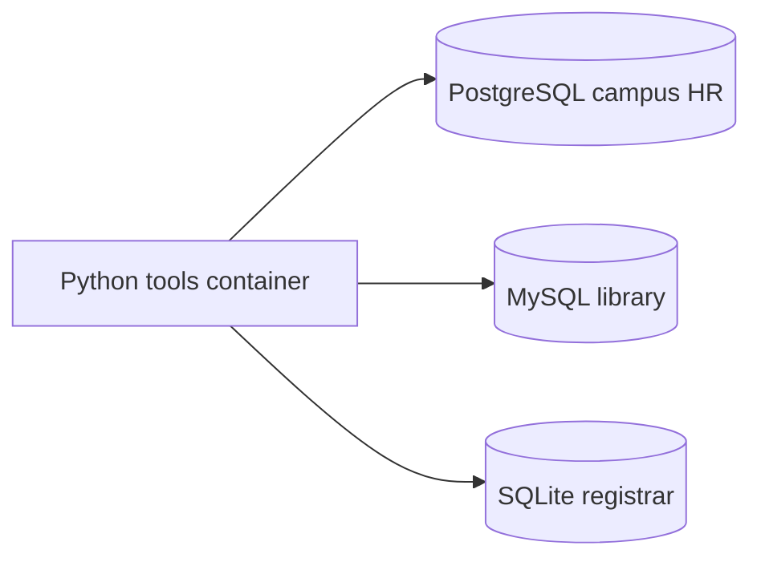

# Rel2KG

Relational tables first. Semantic web next.

Three independently run campus systems store overlapping facts about the same people. This repo instantiates those systems with **Docker only** — nothing is installed on the host — so later work (R2RML / RDFS / SPARQL) has real heterogeneous sources to map.

Apache-2.0.

## Why these three databases

They are the three most widely used open-source relational engines, and they disagree just enough to be useful for integration:

| Engine | Role in this lab | Why it is here |
| --- | --- | --- |
| **PostgreSQL 16** | Campus HR (`campus`) | Default serious open-source server RDBMS. Official image: `postgres:16-alpine`. |
| **MySQL 8.4** | Campus library (`library`) | Dominant open-source server RDBMS in production. Official image: `mysql:8.4`. |
| **SQLite 3** | Campus registrar (`courses.db`) | Most widely deployed embedded RDBMS. Created inside the Python image onto a Docker volume — still no host install. |

Same people, three schemas, three dialects. The join key today is email. Later it becomes an IRI.

## Simple schemas

PostgreSQL — people:

- `department(id, code, name)`
- `employee(id, given_name, family_name, email, department_id, hired_on)`

MySQL — books and loans:

- `author(id, full_name, email)`
- `book(id, isbn, title, published_year, author_id)`
- `loan(id, borrower_email, book_id, loaned_on, returned_on)`

SQLite — courses:

- `course(id, code, title, credits)`
- `enrollment(id, student_email, course_id, term, grade)`



## Requirements

- Docker Desktop (or another Docker Engine with Compose v2)
- That is all. Python, drivers, and the databases run in images.

## Instantiate

From this directory:

```bash
docker compose up --build -d
docker compose run --rm tools
```

The first command starts PostgreSQL and MySQL and loads their seed SQL (first run only, while the data volumes are empty). The second command creates the SQLite file on a volume and prints a status report from all three sources.

Re-run the report any time:

```bash
docker compose run --rm tools python -m rel2kg verify
```

Stop, keep data:

```bash
docker compose down
```

Stop and wipe volumes (re-seed from scratch on next up):

```bash
docker compose down -v
```

### Host ports

| Source | Host | Inside Compose |
| --- | --- | --- |
| PostgreSQL | `localhost:5432` | `postgres:5432` |
| MySQL | `localhost:3306` | `mysql:3306` |
| SQLite | volume `sqlite_data` → `/data/courses.db` | same path in `tools` |

Demo credentials (local lab only): user `rel2kg`, password `rel2kg`. Override with a `.env` copied from `.env.example` if 5432 or 3306 are already taken (`POSTGRES_HOST_PORT`, `MYSQL_HOST_PORT`).

## Layout

```
docker-compose.yml     PostgreSQL + MySQL + Python tools
docker/python.Dockerfile
db/postgres/init.sql   HR schema + seed
db/mysql/init.sql      library schema + seed
db/sqlite/init.sql     registrar schema + seed
src/rel2kg/            init SQLite, verify all three
```

## Push to GitHub

This directory is its own git repository. Create an empty GitHub repo named `rel2kg` (or anything you like), then:

```bash
git remote add origin git@github.com:<your-username>/rel2kg.git
git branch -M main
git push -u origin main
```

If you still need a first commit:

```bash
git add .
git commit -m "Initial commit: PostgreSQL, MySQL, and SQLite sources"
```

## What is deliberately not here yet

- R2RML / Direct Mapping
- OWL / RDFS vocabulary
- SPARQL or a triple store
- A web UI

The tables exist and overlap. Mapping them is the next step.
